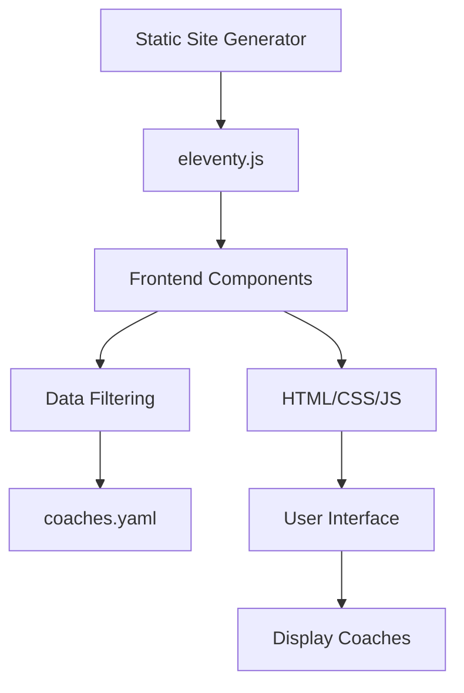
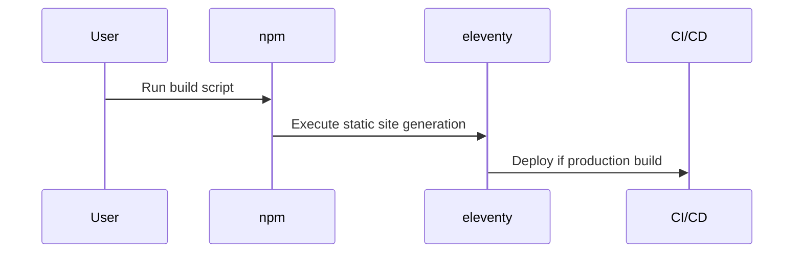
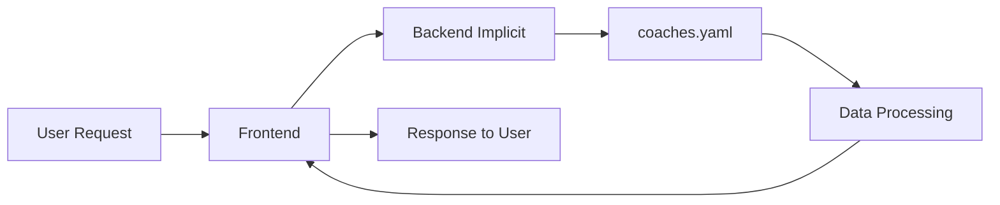

# Architectural Diagrams for GreatCTO Project

## C4 Container Diagram

This diagram visualizes the system architecture using containers and their interactions.

## Sequence Diagram for Build Process

This diagram shows the sequence of actions during the build process.

## Data Flow Diagram

Simplifies the data handling between frontend and data source.

## Notes

- These diagrams are based on reverse engineering and can be expanded with more details.
- Use Mermaid tools to render these diagrams in Markdown viewers.
